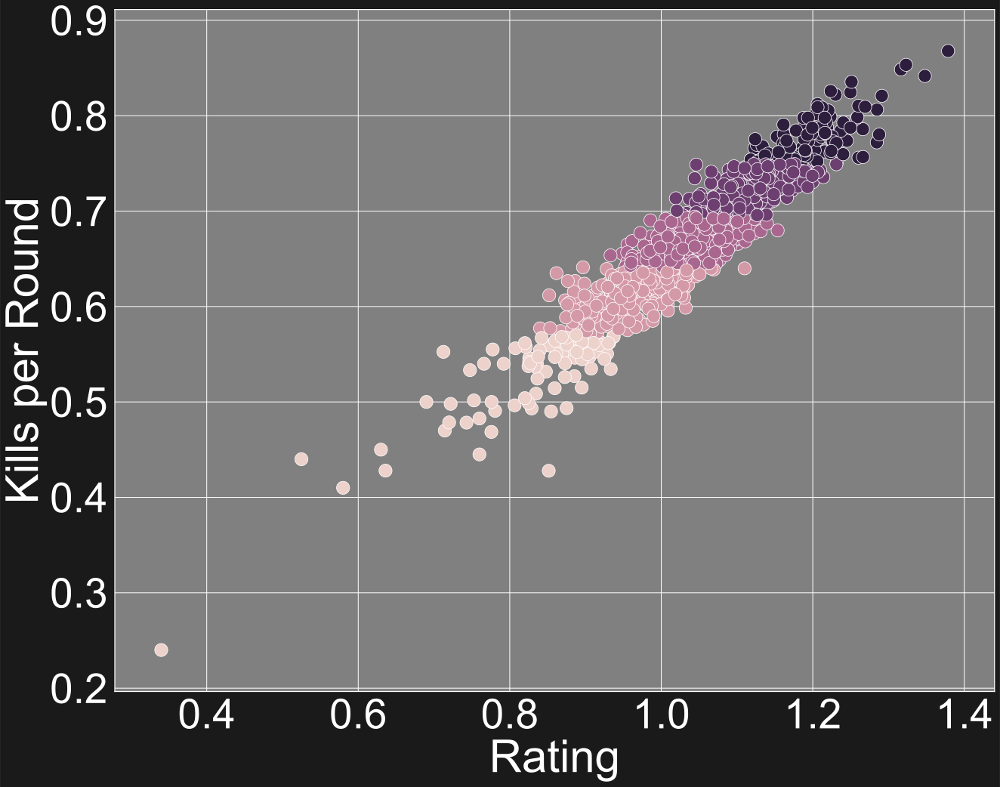

# insight-csgo
This repository contains the model for my Insight Data Science project, which involves a web app that evaluates whether a roster change in a "Counter Strike: Global Offensive" professional team is potentially a good change.

## Methodology

### Match outcomes
* This repository uses a Random Forest classifier to predict the outcome of a match.
* The final features include differences in metrics between the two opposing teams, inlcuding how much money the players have earned, their ratings, win rate, etc.
* For evaluation whether a change in a player is good, we also construct an "average opponent" for each team by getting the average metrics of the past opponents.

### Star ratings
* To create the star ratings of the players, for each desired metric we used k-means with 5 clusters.

### Recommendation
* The recommendations are done by doing a nearest neighbor search to an ideal replacement (picked by the user).
* A projection to all five tiers in price stars is done to try to find undervalued players.

## Related repositories
* In 'emmanuel-garza/moneyball-csgo' is located the source code for the web app, whose url is: http://helmholtzanalytics.xyz/
* In 'emmanuel-garza/insight-csgo-data' is located the source code for the data collection.